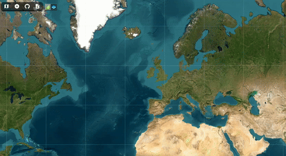

# Zarr-maps Visualization Toolkit

[](https://www.npmjs.com/package/zarr-maps)
[](https://opensource.org/licenses/MIT)
[](https://noc-oi.github.io/zarr-maps/docs)

**Leaflet and OpenLayers layers for interactive 2D visualization of geospatial data stored in Zarr format.**

- Documentation: [https://noc-oi.github.io/zarr-maps/docs](https://noc-oi.github.io/zarr-maps/docs)
- Demo: [https://noc-oi.github.io/zarr-maps/](https://noc-oi.github.io/zarr-maps/)

<br/>



> Example of visualizing a Zarr dataset in Leaflet and Openlayers maps using zarr-maps. You can dynamically change time slices, colormaps, and scale ranges.

## Overview

The **Zarr-maps Visualization Toolkit** provides **Leaflet GridLayer-based rendering** and **OpenLayers layer rendering** for n-dimensional datasets stored in the [Zarr](https://zarr.dev) format. It is streamed directly from cloud object stores (HTTP/S3/GCS) without preprocessing, conversion, or a backend server.

It is designed for fast, on-demand raster visualization in Leaflet and OpenLayers using **GPU-accelerated WebGL color-mapping**.

### Features

- **Zarr v2 and v3 compatibility**
  Read datasets from any Zarr store, including public cloud object storage.

- **Multiscale or single-scale datasets**
  Automatically handles multi-resolution datasets (e.g., ndpyramid-style multiscales) or standard Zarr arrays.

- **Leaflet-native tiling**
  Uses `L.GridLayer` to request tiles based on current map view.

- **OpenLayers-native tiling**
  Uses `ol/layer/Tile` to request tiles based on current map view.

- **CRS-aware**
  Supports EPSG:4326 (Geographic) and EPSG:3857 (Web Mercator) with automatic detection.

- **On-demand streaming**
  Only the required slices are fetched and decoded dynamically.

- **GPU-accelerated rendering**
  Uses WebGL2 shaders to apply colormaps and masks.

- **Selectors for extra dimensions**
  Slice time/elevation/other dimensions by index or by nearest value.

- **Style controls**
  Update colormap and scale range programmatically (with redraw).

---

## Installation

```bash
npm install zarr-maps
```

---

## Quick start

### Leaflet Example

```ts
import L from 'leaflet';
import { ZarrLayer } from 'zarr-maps/leaflet';

const map = L.map('map', {
  center: [36.1, -5.4],
  zoom: 6
});

L.tileLayer('https://{s}.tile.openstreetmap.org/{z}/{x}/{y}.png', {
  attribution: '&copy; OpenStreetMap contributors'
}).addTo(map);

const zarrLayer = new ZarrLayer({
  url: 'https://example.com/my.zarr',
  variable: 'salinity',
  colormap: 'viridis',
  scale: [30, 40],
  selectors: {
    time: { type: 'index', selected: 0 },
    elevation: { type: 'index', selected: 0 }
  }
});

// Await readiness before adding to map
await zarrLayer.load();
zarrLayer.addTo(map);
```

### OpenLayers Example

```ts
import 'ol/ol.css';
import Map from 'ol/Map';
import View from 'ol/View';
import { Tile as TileLayer } from 'ol/layer';
import { OSM } from 'ol/source/OSM';
import { ZarrLayer } from 'zarr-maps/ol';

const map = new Map({
  target: 'map',
  layers: [
    new TileLayer({
      source: new OSM()
    })
  ],
  view: new View({
    center: [0, 0],
    zoom: 2
  })
});

const zarrLayer = new ZarrLayer({
  url: 'https://example.com/my.zarr',
  variable: 'temperature',
  colormap: 'plasma',
  scale: [270, 310],
  selectors: {
    time: { type: 'index', selected: 0 }
  }
});

// Await readiness before adding to map
await zarrLayer.load();
map.addLayer(zarrLayer);
```

---

## Architecture

The toolkit provides two key layers components for Leaflet and OpenLayers, backed by a shared data provider that handles Zarr access and WebGL rendering:

| Component                  | Purpose                 | Description                                                                     |
| -------------------------- | ----------------------- | ------------------------------------------------------------------------------- |
| `ZarrLayer` for Leaflet    | Leaflet layer           | A `L.GridLayer` that Leaflet controls (tile lifecycle, zoom, redraw).           |
| `ZarrLayer` for OpenLayers | OpenLayers layer        | An `ol/layer/Tile` that OpenLayers controls (tile lifecycle, zoom, redraw).     |
| `ZarrLayerProvider`        | Data + rendering engine | Opens Zarr, loads metadata/dimensions, fetches slices, renders tiles via WebGL. |

---

## Run the demo locally

```bash
git clone https://github.com/noc-oi/zarr-maps.git
cd zarr-maps/demo
npm install
npm run dev
```

Demo site: `http://localhost:5173/`

To use your own Zarr datasets, modify the demo layer config (example path may vary by branch):

- `demo/src/application/data/layers-json.tsx`

---

## DEVELOPMENT

For more details on how to contribute to the development of this toolkit, please refer to the [DEV-README.md](DEV-README.md) file.

---

## Acknowledgements

This tool is built with:

- [Leaflet](https://leafletjs.com/)
- [OpenLayers](https://openlayers.org/)
- [Zarrita](https://zarrita.dev/)
- [jscolormaps](https://github.com/timothygebhard/js-colormaps)

This work is part of the [Atlantis project](https://atlantis.ac.uk/), a UK initiative supporting long-term ocean observations and marine science in the Atlantic. The project is led by the [National Oceanography Centre (NOC)](https://noc.ac.uk/).
